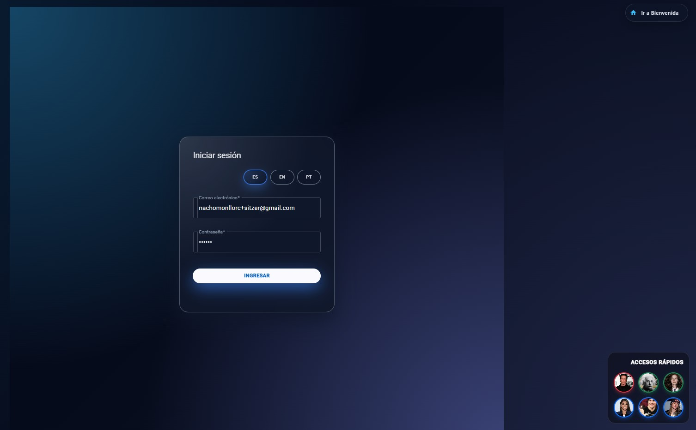
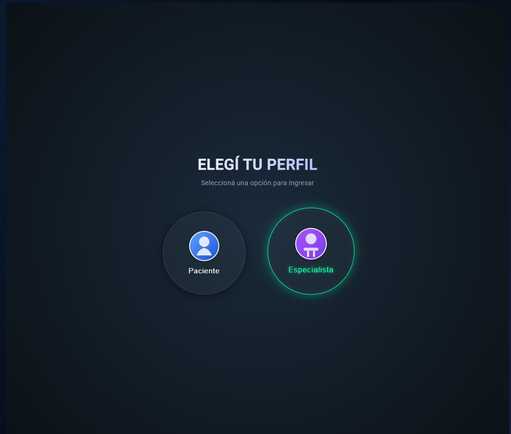

# Clínica Online - Laboratorio de Computación IV

Este proyecto es una aplicación web Single Page Application desarrollada en **Angular** para la gestión de una clínica médica. El sistema permite la administración de usuarios, gestión de turnos médicos, historias clínicas y reportes estadísticos.

## Funcionalidades Principales

### [cite_start] Módulo de Usuarios [cite: 25, 33, 59]
* **Registro:**
    * Pacientes (con carga de imágenes de perfil).
    * Especialistas (requieren aprobación del administrador).
* **Login:** Validación de email verificado y aprobación administrativa (para especialistas).
**Captcha:** Implementación propia y/o servicio externo para seguridad en registros.

### [cite_start] Gestión de Turnos 
* [cite_start]**Solicitud:** Filtros por especialidad y médico (sin usar combobox, con selección visual)
* **Estados:** Los turnos pasan por estados: Pendiente, Aceptado, Rechazado, Cancelado, Realizado.
* **Acciones:**
     **Paciente:** Cancelar, Ver Reseña, Completar Encuesta, Calificar Atención[cite: 94].
     **Especialista:** Rechazar, Aceptar, Finalizar (con carga de historia clínica), Ver Reseña[cite: 114].
     **Admin:** Cancelar turnos, Solicitar turnos para terceros[cite: 146].

### [cite_start] Historia Clínica y Reportes [cite: 186, 220]
* [cite_start]Carga de datos fijos (Altura, Peso, Temperatura, Presión) y dinámicos[cite: 195].
* [cite_start]Descarga de **Historia Clínica en PDF** con logo de la clínica[cite: 183].
* [cite_start]Exportación de listas de usuarios a Excel[cite: 182].

### [cite_start]📊 Estadísticas y Gráficos [cite: 219]
Panel administrativo con gráficos interactivos (ApexCharts/Chart.js) descargables en PDF/Excel:
* [cite_start]Logs de ingreso al sistema[cite: 221].
* [cite_start]Turnos por especialidad y por día[cite: 224, 225].
* [cite_start]Turnos solicitados/finalizados por médico[cite: 226, 227].

---

## 📷 Galería de Pantallas

### 1. Bienvenida y Login
*Acceso principal al sistema.*

### 2. Registro de Usuarios
*Alta de Pacientes y Especialistas con validaciones.*

### 3. Solicitud de Turnos
*Selección de especialidad y profesional con horarios dinámicos.*

### 4. Dashboard de Turnos (Paciente/Especialista)
*Listado de turnos con filtros y acciones rápidas.*

### 5. Panel de Estadísticas
*Gráficos para el administrador.*

---

## 🛠️ Tecnologías Utilizadas
* **Framework:** Angular 17+
* **Base de Datos / Backend:** Firebase (Firestore, Auth, Storage)
* **Diseño:** Angular Material, SCSS, Animaciones.
* **Librerías Extra:** * `jspdf` & `html2canvas` (PDFs)
    * `ng-apexcharts` (Gráficos)
    * `xlsx` (Excel)
