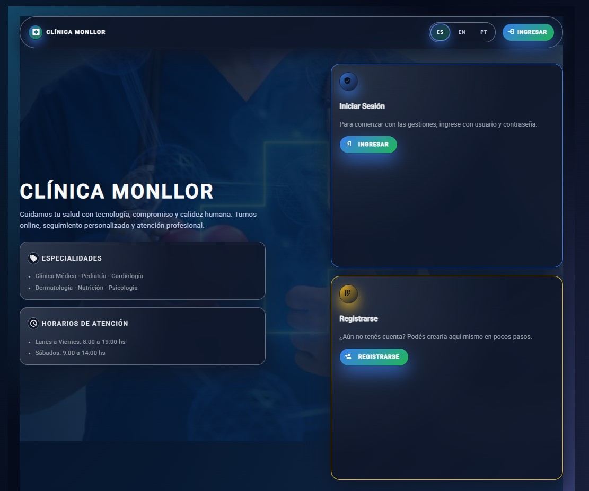
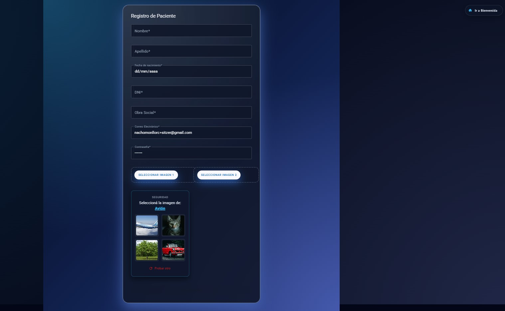

# Clínica Online - Sistema de Gestión de Turnos

Este proyecto es una aplicación web desarrollada en **Angular** como trabajo final para la materia **Laboratorio de Computación IV** de la **UTN Avellaneda**. El sistema permite la gestión integral de una clínica, administrando pacientes, especialistas y turnos médicos con flujos diferenciados por rol.

---

## Funcionalidades y Pantallas

### 1. Acceso y Seguridad (Sprint 1)
La aplicación cuenta con una **Página de Bienvenida** con accesos rápidos. El sistema de autenticación incluye verificación de email y aprobación administrativa para especialistas

#### Login y Registro
  **Registro de Pacientes:** Se capturan datos personales, obra social y dos imágenes de perfil

  

  **Registro de Especialistas:** Permite seleccionar o añadir especialidades dinámicamente:

  

  **Captcha:** Implementado en los registros para mayor seguridad

---

### 2. Módulo de Pacientes 
Los pacientes pueden gestionar su atención médica de forma autónoma.

#### Solicitar Turno

Un asistente paso a paso permite seleccionar especialidad, médico y horario disponible (próximos 15 días), con validaciones de disponibilidad.

* Solo aparecen horarios disponibles:

 

# El paciente puede solicitar un turno:

 

# Solo aparecen especialistas de la especialidad seleccionada:

#### Mis Turnos y Perfil
# Visualización de turnos con filtro único (por especialidad o especialista):

  

# Acciones disponibles: Cancelar turno, ver reseña, completar encuesta y calificar atención

 **Perfil:** Descarga de **Historia Clínica en PDF** con logo de la clínica

### 3. Módulo de Especialistas (Sprint 2 & 3)

Los médicos cuentan con herramientas para administrar su agenda y pacientes

#### Gestión de Turnos y Agenda
**Mis Horarios:** El especialista define su disponibilidad horaria por especialidad.
**Administración de Turnos:** Permite Aceptar, Rechazar o Finalizar turnos dejando reseñas diagnósticas.

#### Carga de Historia Clínica
Al finalizar un turno, el especialista carga la historia clínica compuesta por datos fijos (altura, peso, temperatura, presión) y datos dinámicos variables

### 4. Modulo de Administracion
Panel de control exclusivo para gestionar la clínica.

#### Gestión de Usuarios

# Visualización de todos los usuarios con capacidad de habilitar o inhabilitar el acceso a Especialistas

# Incluye descarga de nómina en Excel

#### Estadísticas e Informes

Pantalla de seleccion de estadisticas:

# Panel gráfico (Charts) con posibilidad de descarga en Excel o PDFIncluye:

* Log de ingresos al sistema:

* Cantidad de turnos por especialidad:

* Cantidad de turnos por dia:

* Informes de turnos solicitados y finalizados por médico:

* Turnos por especialidad:

## Características Técnicas Adicionales
**Animaciones:** Transiciones entre componentes (mínimo 6 aplicadas)

**Directivas y Pipes:** Personalizados para mejorar la UX/UI

**Captcha Propio:** Implementado como directiva reutilizable

**Multilenguaje (Sprint 6):** Soporte para Español, Inglés y Portugués

**Encuestas:** Sistema de encuestas de satisfacción con diversos controles

### Tecnologías Utilizadas:

**Frontend:** Angular (Framework)
**Base de Datos:** Supabase
**Almacenamiento:** Supabase Storage 
**Librerías:** `chart.js` (Gráficos), `jspdf` (Reportes), `xlsx` (Excel)

  
